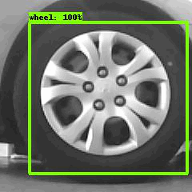

<h1 align=center>Wheel Detection with ResNet50 and Object Detection API</h1>

<small>Picture Source:<a  href="https://www.automoblog.net/"> automoblog</a>

 

<h2>Description</h2>

Manually checking each tire can be sped up by employing an automated camera system that captures images of vehicles as they drive past. Machine learning models can process these images to determine are there any tires or not. This dataset consists of images captured by an <i>OpenMV Cam H7 Plus</i>. It includes 900 <i>240x240</i> grayscale images. Provided is a directory tire-dataset that contains the entire dataset as .jpg images.

<i>In terms of diversity, this project has a relatively limited perception. If you want to diversify, you are free to modify.</i> In addition, I just want to thank you for all the help Mr. <b>Laurence Moroney</b>! I learned a lot from you!

 

<h2>Acknowledgements</h2>

This dataset and information about dataset have been referred from <a  href="https://www.kaggle.com/datasets/rhammell/full-vs-flat-tire-images">Kaggle</a>.

 

<h2>Objective:</h2>

The aim of this project is to create a tire detection model based on the data. In the creation of this object detection model, <i>ResNet50</i> and <i>Object Detection API</i> have been used.

<ul>
	<li>Installling necessery libraries and models.</li>
	<li>Build wheel detection model with ResNet50</li>
	<li>Build ground truth boxes with <code>colab_utils.annotate</code>.</li>
</ul>

	
	
 

<h2>Keywords</h2>

<ul>
	<li>Automobile and Vehicle</li>
	<li>Object Detection</li>
	<li>Computer Vision</li>
	<li>SSD ResNet50</li>
	<li>Object Detection API</li>
</ul>

 

<h2>Required Inputs</h2>

Install TensorFlow

	
	!pip install -U --pre tensorflow=="2.2.0"

Clone the tensorflow models repository if it doesn't already exist

	if  "models"  in pathlib.Path.cwd().parts:
		while  "models"  in pathlib.Path.cwd().parts:
			os.chdir('..')
	elif  not pathlib.Path('models').exists():
		!git clone --depth 1 https://github.com/tensorflow/models

Install the Object Detection API

	%%bash
	cd models/research/
	protoc object_detection/protos/*.proto --python_out=.
	cp object_detection/packages/tf2/setup.py .
	python -m pip install .

Download SSD ResNet50 v1

	!wget http://download.tensorflow.org/models/object_detection/tf2/20200711/ssd_resnet50_v1_fpn_640x640_coco17_tpu-8.tar.gz
	!tar -xf ssd_resnet50_v1_fpn_640x640_coco17_tpu-8.tar.gz
	!mv ssd_resnet50_v1_fpn_640x640_coco17_tpu-8/checkpoint models/research/object_detection/test_data/

 

<h2>Refecences</h2>

<ul>
	<li><a  href="https://www.kaggle.com/datasets/rhammell/full-vs-flat-tire-images">Kaggle</a></li>
	<li><a  href="https://laurencemoroney.com/">Laurence Moroney</a></li>
	<li><a  href="https://www.coursera.org/learn/advanced-computer-vision-with-tensorflow#instructors">Advanced Computer Vision with TensorFlow</a></li>
	<li><a  href="https://github.com/tensorflow/models">TensorFlow GitHub</a></li>
</ul>

 

<h2>Contact Me</h2>

If you have something to say to me please contact me:

<ul>
 <li>Twitter: <a href="https://twitter.com/Doguilmak">Doguilmak</a></li>
 <li>Mail address: doguilmak@gmail.com</li>
</ul>
